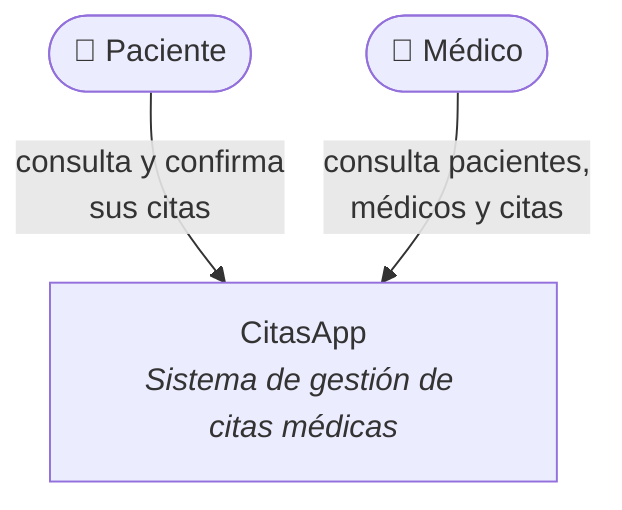
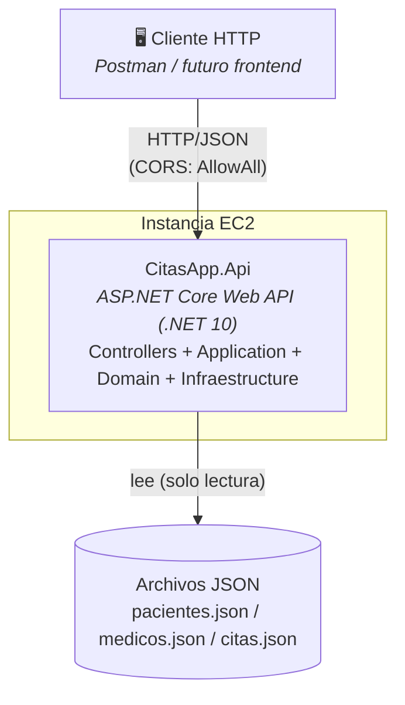
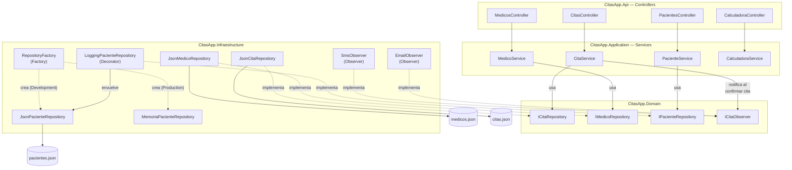

# Arquitectura como código de CitasApp — Modelo C4 (Niveles 1 a 3)
---

## Nivel 1 — Contexto

**Para quién es:** cualquier persona (equipo, cliente, profesor). **Qué responde:** qué es el sistema y quién lo usa, sin ningún detalle técnico.

---

## Nivel 2 — Contenedores

**Para quién es:** el equipo técnico. **Qué responde:** de qué piezas grandes está hecho el sistema y cómo se comunican.

---

## Nivel 3 — Componentes (dentro de CitasApp.Api)

**Para quién es:** quien va a modificar el código. **Qué responde:** qué hay dentro de cada capa y dónde viven los patrones GOF (Semana 8).

