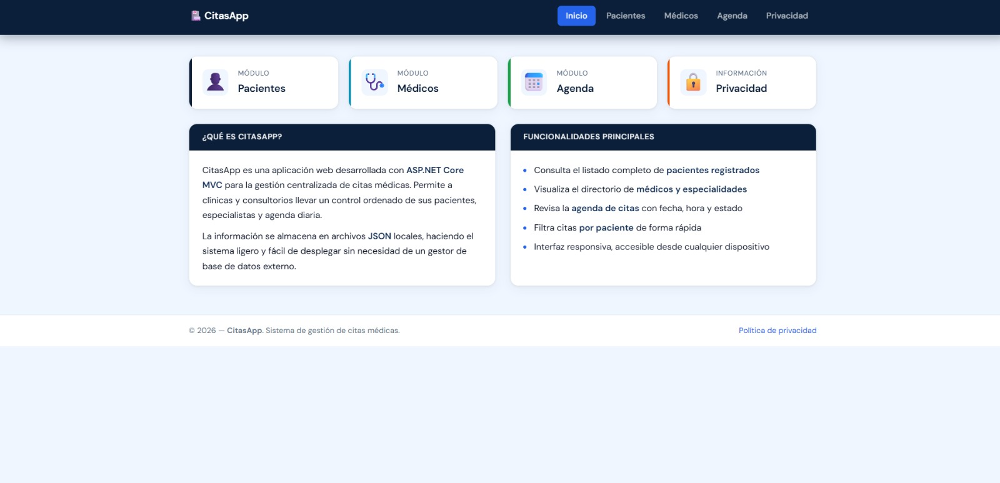
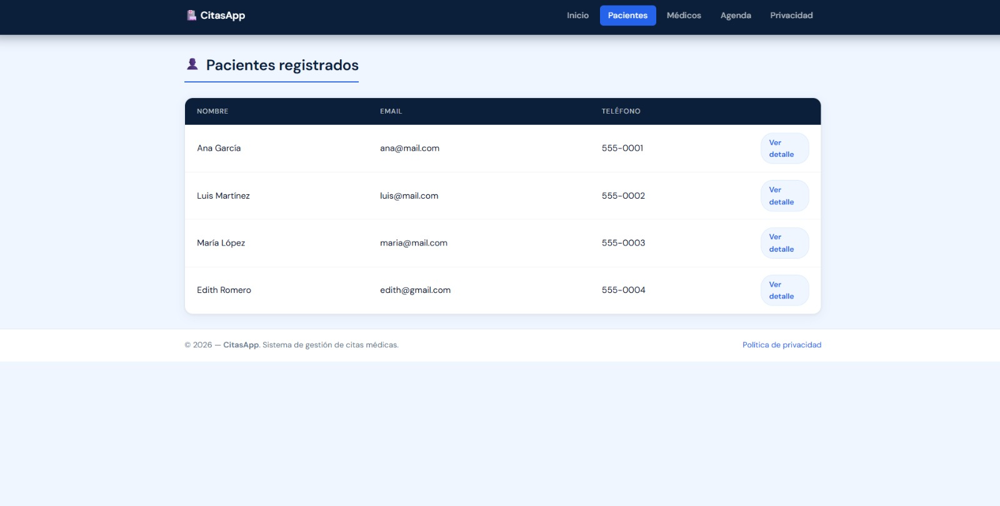
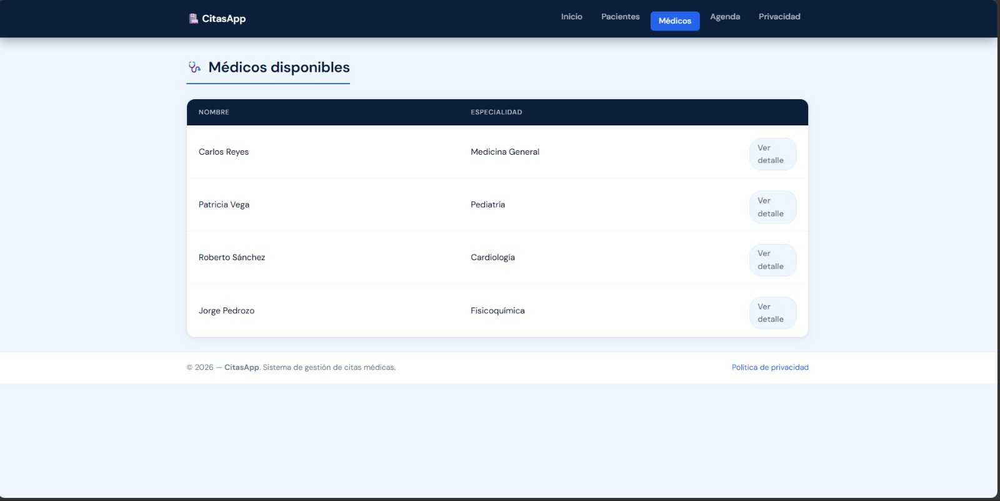
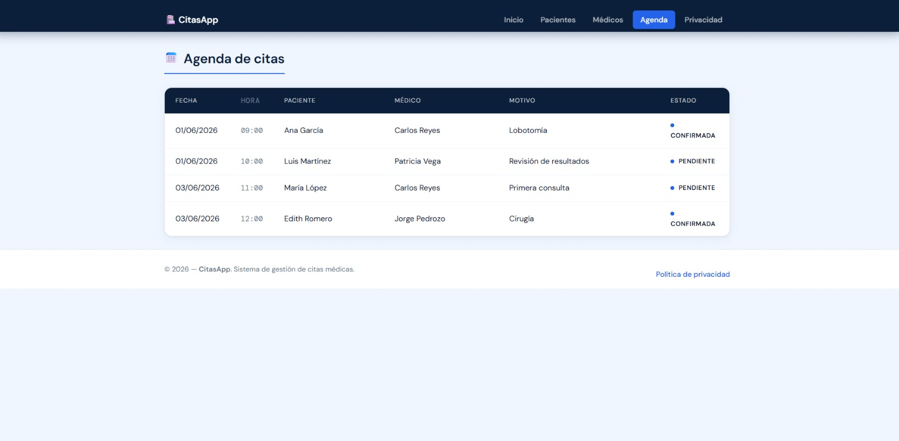
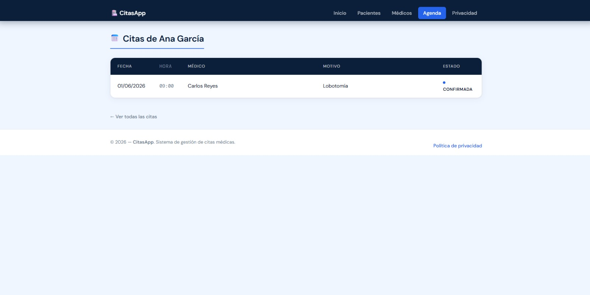

## 👨‍💻 Información del Estudiante

- **Nombre:** Ariff Medina
- **Matrícula:** SW2509006
- **Grupo:** A
- **Cuatrimestre:** Tercer Cuatrimestre
- **Carrera:** TSU en Desarrollo e Innovación de Software
- **Profesor:** Jorge Javier Pedrozo Romero

# 🏥 CitasApp

Sistema de gestión de citas médicas desarrollado con ASP.NET Core MVC. Permite administrar pacientes, médicos y agenda de citas desde una interfaz web limpia, sin necesidad de una base de datos externa.

---

## Tabla de contenidos

- [Descripción general](#descripción-general)
- [Estructura del proyecto](#estructura-del-proyecto)
- [Funcionamiento básico](#funcionamiento-básico)
- [Sistema de estilos CSS](#sistema-de-estilos-css)
- [Vistas previas](#vistas-previas)
- [Requisitos](#requisitos)
- [Cómo ejecutar el proyecto](#cómo-ejecutar-el-proyecto)
- [Cláusula de uso de inteligencia artificial](#cláusula-de-uso-de-inteligencia-artificial)

---

## Descripción general

CitasApp es una aplicación web construida con el patrón MVC de ASP.NET Core. La persistencia de datos se maneja a través de archivos JSON locales en lugar de un gestor de base de datos, lo que hace que el sistema sea sencillo de desplegar y de mantener.

La aplicación cubre tres módulos principales: gestión de pacientes, directorio de médicos y una agenda de citas que relaciona ambos.

---

## Estructura del proyecto

```
CitasApp/
│
├── Controllers/
│   ├── HomeController.cs          # Inicio y política de privacidad
│   ├── PacienteController.cs      # Listado y detalle de pacientes
│   ├── MedicoController.cs        # Listado y detalle de médicos
│   └── CitaController.cs          # Agenda general y filtro por paciente
│
├── Models/
│   ├── Paciente.cs                # Id, Nombre, Apellido, Email, Telefono
│   ├── Medico.cs                  # Id, Nombre, Apellido, Especialidad, NumeroLicencia
│   ├── Cita.cs                    # Id, PacienteId, MedicoId, Fecha, Hora, Motivo, Estado
│   ├── CitaJson.cs                # Modelo auxiliar para deserialización JSON
│   └── ErrorViewModel.cs
│
├── Interfaces/
│   ├── IPacienteRepository.cs
│   ├── IMedicoRepository.cs
│   └── ICitaRepository.cs
│
├── Repositories/
│   ├── JsonPacienteRepository.cs  # Lee pacientes.json
│   ├── JsonMedicoRepository.cs    # Lee medicos.json
│   └── JsonCitaRepository.cs      # Lee citas.json
│
├── Data/
│   ├── pacientes.json
│   ├── medicos.json
│   └── citas.json
│
├── Views/
│   ├── Shared/
│   │   ├── _Layout.cshtml         # Plantilla base (navbar + footer)
│   │   └── _Layout.cshtml.css
│   ├── Home/
│   │   ├── Index.cshtml           # Dashboard con accesos rápidos
│   │   └── Privacy.cshtml
│   ├── Paciente/
│   │   ├── Index.cshtml           # Tabla de pacientes
│   │   └── Detalle.cshtml         # Ficha de un paciente
│   ├── Medico/
│   │   ├── Index.cshtml           # Tabla de médicos
│   │   └── Detalle.cshtml         # Ficha de un médico
│   └── Cita/
│       ├── Index.cshtml           # Agenda completa de citas
│       └── PorPaciente.cshtml     # Citas filtradas por paciente
│
├── wwwroot/
│   ├── css/
│   │   ├── site.css               # Estilos base de Bootstrap y globales
│   │   ├── Layout.css             # Navbar, footer, variables de color, animaciones
│   │   ├── Home.css               # Tarjetas del dashboard y tech grid
│   │   ├── Medico.css             # Tabla y detalle de médicos
│   │   ├── Paciente.css           # Tabla y detalle de pacientes
│   │   └── Cita.css               # Agenda de citas y badge de estado
│   ├── js/
│   │   └── site.js
│   └── lib/
│   |   ├── bootstrap/
│   |   └── jquery/
│   └── assets/
│       ├── home.jpeg
│       ├── pacientes.jpeg
│       ├── medicos.jpeg
│       ├── citas-por-paciente.jpeg
│       ├── citas.jpeg
│
├── Program.cs
├── CitasApp.csproj
└── appsettings.json
```

---

## Funcionamiento básico

### Inicio

La página principal muestra cuatro accesos rápidos a los módulos disponibles: Pacientes, Médicos, Agenda y Privacidad. También incluye una descripción del sistema y un resumen de las tecnologías utilizadas.

### Pacientes

La ruta `/Paciente` lista todos los pacientes registrados en `pacientes.json`. Cada fila de la tabla tiene un enlace a la ficha individual del paciente, donde se muestran sus datos de contacto y un botón para ver sus citas asociadas.

### Médicos

La ruta `/Medico` muestra el directorio completo de médicos con nombre, apellido y especialidad. Al acceder al detalle de un médico, se agrega su número de licencia profesional.

### Agenda de citas

La ruta `/Cita` presenta todas las citas registradas en `citas.json`. Cada registro incluye fecha, hora, paciente, médico, motivo de consulta y estado. El estado por defecto es `Pendiente`.

Desde la ficha de un paciente también se puede acceder a `/Cita/PorPaciente/{id}`, que filtra únicamente las citas de ese paciente.

### Flujo de datos

Cada controlador recibe su repositorio correspondiente por inyección de dependencias, según lo configurado en `Program.cs`. Los repositorios leen los archivos JSON en la carpeta `Data/` y devuelven listas de modelos fuertemente tipados. No hay escritura en ningún momento: la aplicación es solo de lectura.

---

## Sistema de estilos CSS

Los estilos están divididos por vista para mantener el código ordenado. Cada archivo CSS carga únicamente en la vista que lo requiere, usando `@section Styles` en Razor.

### Layout.css

Archivo principal. Define las variables de color en `:root`, la tipografía (Nunito, cargada desde Google Fonts), el navbar fijo con indicador de enlace activo, el footer y la animación de entrada `fade-up`. Todos los demás archivos CSS heredan estas variables.

Variables principales:

| Variable | Valor | Uso |
|---|---|---|
| `--blue` | `#2b7fdb` | Color principal de acción |
| `--blue-dark` | `#1a5fb4` | Hover de botones y encabezados |
| `--blue-light` | `#e8f2fd` | Fondos de cabeceras y hover de filas |
| `--blue-mid` | `#bbdaf7` | Bordes y separadores |
| `--bg` | `#f5f9ff` | Fondo general de la página |
| `--text` | `#1e2a38` | Texto principal |
| `--text-muted` | `#6c7a8d` | Texto secundario |

### Home.css

Estilos para las tarjetas de acceso rápido (`stat-card`), las tarjetas informativas (`info-card`) con cabecera azul claro, y los badges de tecnología con colores diferenciados por tipo.

### Medico.css y Paciente.css

Ambos archivos comparten una estructura similar: tabla sin bordes visibles, cabecera con fondo azul claro, filas con hover sutil, y links de "Ver detalle" convertidos en pastillas con transición de color. En `Paciente.css` el botón "Ver sus citas" tiene un estilo más destacado (fondo azul sólido con efecto al hover).

### Cita.css

Similar a los anteriores en la tabla. La columna de estado se muestra como un badge con fondo azul claro para diferenciarse del texto normal.

---

## Vistas previas

### Inicio / Dashboard



### Pacientes



### Médicos



### Agenda de citas



### Citas por paciente



> Para agregar las capturas: ejecuta el proyecto, toma capturas de cada vista y guárdalas en `docs/screenshots/` con los nombres indicados arriba.

---

## Requisitos

- .NET 8 SDK o superior
- Navegador moderno (Chrome, Firefox, Edge)
- No se requiere instalar ni configurar ninguna base de datos

---

## Cómo ejecutar el proyecto

1. Clona o descarga el repositorio.

2. Abre una terminal en la carpeta raíz del proyecto (donde está el archivo `.csproj`).

3. Restaura las dependencias y ejecuta:

```bash
dotnet run
```

4. Abre el navegador en la dirección que aparezca en la terminal, normalmente `https://localhost:5001` o `http://localhost:5000`.

5. La aplicación carga los datos desde los archivos en `Data/`. Si quieres agregar o modificar registros, edita directamente los archivos `pacientes.json`, `medicos.json` o `citas.json` y reinicia el servidor.

---

## Cláusula de uso de inteligencia artificial

Una parte del código de este proyecto fue generada con el apoyo de herramientas de inteligencia artificial, específicamente en lo relativo al diseño visual y los archivos CSS.

Los archivos afectados son:

- `wwwroot/css/Layout.css`
- `wwwroot/css/Home.css`
- `wwwroot/css/Medico.css`
- `wwwroot/css/Paciente.css`
- `wwwroot/css/Cita.css`

Estos archivos fueron generados con asistencia de Claude (Anthropic) a partir de las vistas Razor existentes y una referencia visual de estilo. El resultado fue revisado y aceptado como parte del proyecto.

El resto del proyecto —controladores, modelos, repositorios, vistas y configuración— fue desarrollado de forma manual por mi.

El uso de IA en este contexto tuvo como objetivo agilizar la parte de estilización, que no es el foco principal de la materia, permitiendo dedicar más tiempo al diseño arquitectónico y la lógica de la aplicación.

---

<div align="center">

**⭐ Si te gustó este proyecto, dale una estrella ⭐**

Hecho con 💙 por Ariff Medina — 2026

</div>

*CitasApp — Proyecto académico, Arquitectura de Software, 2026.*
